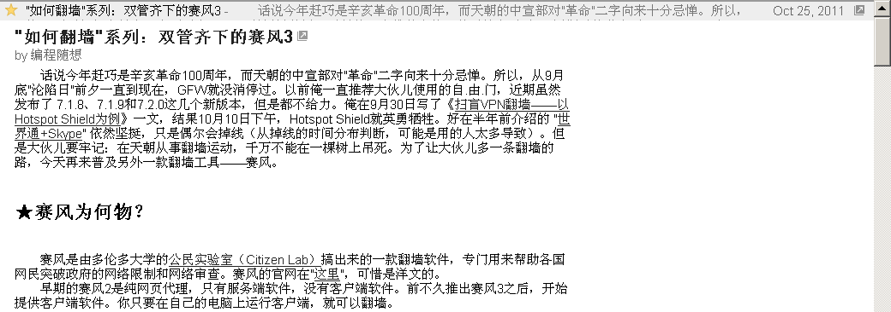
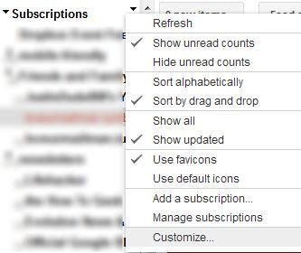
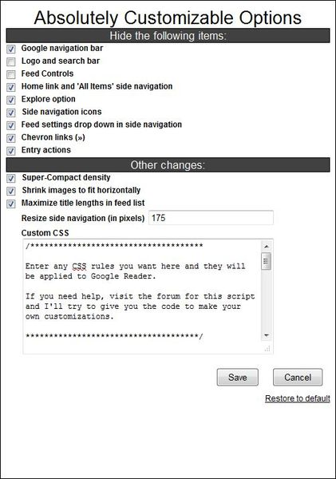
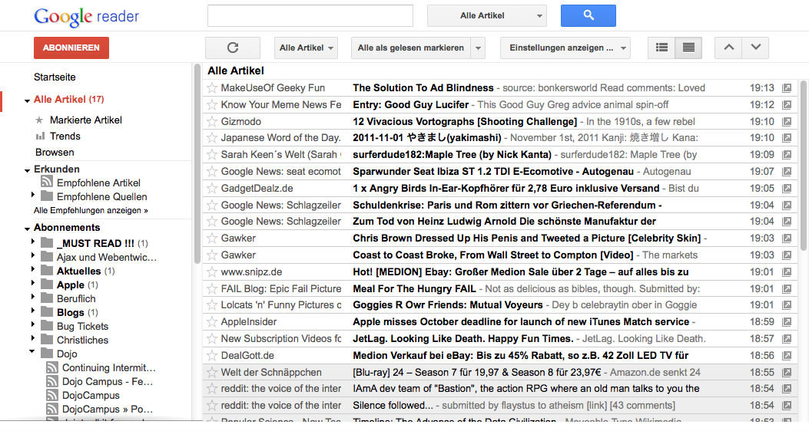
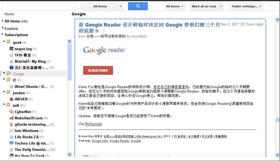

# 如何用 GreaseMonkey 扩展 Google Reader 

-----

 在说正题之前先插一句：Google 为了强行推广 G+，把 Google 阅读器的社交功能都阉了。今后，大伙儿如果想看俺的分享，除了继续用 Google Reader 订阅俺的博客（俺博客的RSS订阅地址： <http://feeds2.feedburner.com/programthink> ），还可以在 Google+ 圈养（俺的 G+ 页面： <https://plus.google.com/113559088971921339544/> ）。  
   
 ## ★引子
---

  
 话说俺一直是 Google Reader 的重度使用者——从2005年10月至今，俺的阅读数已超过13万。上周 Google 放出风声说要改版，俺还是满心期待的。谁曾想，昨天（11年11月1日）发布的新版本，那界面真是让人大跌眼镜——怎一个"烂"字了得！  
 不过，抱怨归抱怨，眼下暂时还没有合适的替代品，Google 阅读器还得接着用下去。为了不至于天天面对这么一个恶心的界面，俺发扬"自己动手丰衣足食"的DIY精神，亲自操刀修改阅读器的界面。有兴趣的同学，可以看看俺的经验分享。program-think  
   
   
 ## ★为啥要美化阅读器？
----------

  
 对于老用户而言，新版的界面简直是惨不忍睹——到处都是多余的空白，显得非常不紧凑。比如：文章的列表界面，间距也太大了。现在一屏能显示的帖子数只有原来的一半。这样一来，大大降低了阅读的效率，浪费的大伙儿的时间。  
 估计很多网友逆来顺受惯了。不管网站推出多么烂的界面，他们都默默忍受。但是，在当今 Web 盛行的互联网时代，普通用户是完全可以自己操刀修改网站界面滴（而且几乎【不需要】专业技术）！此中之奥妙，在于**GreaseMonkey**这一大杀器。  
   
   
 ## ★GreaseMonkey 扫盲
----------------

  
 ### ◇GreaseMonkey 是啥玩意儿？

  
 GreaseMonkey 俗称"油猴"，官网在"[这里](http://www.greasespot.net/)"，维基百科的介绍在"[这里](https://zh.wikipedia.org/wiki/Greasemonkey)"。它早先是 Firefox 的一款插件。但它可不是普通的插件，**它是插件的插件**。简单来说，你可以通过 JavaScript 脚本（以下简称“JS 脚本”），来扩展它的功能。因此，只要 JS 脚本能搞定的事情，它都能搞定。而且，你可以指定某个脚本仅仅作用在某个 URL（某个网站）——也就是把脚本跟网站绑定。这样一来，就可以专门针对某个网站的页面进行调整。  
   
 ### ◇油猴能干啥？

  
 看到这里，肯定有人要问了，这些油猴脚本，都能干些啥事捏？俺举几个例子：  
 比如，某个网站的广告条太碍眼，你可以用 JS 脚本把广告条干掉。  
 比如，你喜欢到某个视频网站去看视频，但是这个视频网站没有下载按钮。于是你就可以用JS脚本给每个视频加上一个下载按钮，方便你下载到本地收藏。  
   
 ### ◇不会写 JS 脚本，咋办？

  
 很多同学会担心，自己不懂得写JS脚本。其实大可不必害怕。因为油猴已经非常的普及，你能想到的大部分需求，早都已经有人（多半是老外）写好了，而且分享出来了。  
 在此，向列位看官隆重介绍：全球最大的（没有之一）油猴脚本收集站点——[UserScripts.org](http://userscripts.org/)。这上面的脚本数量，已经到了6位数。由于脚本太多，你第一次上去的时候，建议先看[它的标签分类](http://userscripts.org/tags)。根据分类，就可以比较容易滴找到自己要的脚本。  
   
 ### ◇支持哪些浏览器？

  
 前面说了，油猴早先是 Firefox 插件，自然是天生支持火狐。后来 Google 看到这玩意儿挺普及，就让 Chome 浏览器原生支持油猴脚本。也就是说，你无需安装额外插件，就可以让 Chrome 运行油猴脚本。Opera从 8.0 开始，貌似也兼容了油猴脚本（俺没试过，不知兼容性如何）。至于使用 IE 的同学，暂时无福享用了（建议尽早抛弃 IE 这种老土的浏览器）。  
   
   
 ## ★增强阅读器功能的脚本
-----------

  
 既然刚才提到了 UserScripts 网站，随便推荐几个脚本，可以为阅读器增加额外的功能。如果你常用 Google 阅读器，可以去尝试一下。  
   
 ### ◇[Google Reader Preview Enhanced](http://userscripts.org/scripts/show/9455)

  
 这个脚本是专门对付那些没有全文输出的RSS（不输出全文的博客，非常讨厌）。当你碰到某个只输出摘要的博文，只要按一下快捷键（Shift+V），该脚本就会在阅读器的正文窗口里，自动显示该博文的全部正文。有了它，你无需离开 Google Reader 就可以看只输出摘要的博客了。  
   
 ### ◇[Google Reader - Colorful List View](http://userscripts.org/scripts/show/8782)

  
 此脚本会给文章列表中的每一个帖子着色。相同订阅源文章，会标注相同的颜色。当你选中某个文件夹（Folder） 时，就可以很清楚看出那些文章来自同一个订阅源。  
 补充一下：貌似这次改版后，此插件不灵了，也不晓得插件的作者啥时候出新版本。  
   
 ### ◇[Google Reader Filter](http://userscripts.org/scripts/show/23671)

  
 看名称就知道，此脚本提供针对文章的过滤功能。你可以设置一些过滤规则，来决定哪些文章在列表中高亮显示，那些文章被排除（变灰）。另外，它还可以帮你隐藏重复的文章。  
   
 ### ◇[Google Reader Subscribers Count](http://userscripts.org/scripts/show/21909)

  
 这个脚本会在窗口的右下角显示当前 RSS 的订阅者数量。  
   
   
 ## ★优化阅读器界面的脚本
-----------

  
 除了上述这些增强功能的脚本，还有很多脚本是用来美化 Google Reader 界面的。这些脚本中，有些是历史悠久的，有些是昨天才发布的（专门针对改版后的丑陋界面）。顺便说一下，Google Reader 刚改版，就冒出一堆美化界面的脚本，可见这次改版非常不得人心。  
   
 ### ◇[Google Reader for wider screens](http://userscripts.org/scripts/show/6415)

  
 这个脚本有些年头了，而且很小巧。它可以充分利用屏幕的空间来显示文章正文，如果是宽屏显示器，则效果更佳。以下是俺截的两张对比图：  
   
 调整前的正文布局  
   
 调整后的正文布局  
   
 ### ◇[Google Reader Absolutely Customizable](http://userscripts.org/scripts/show/58577)

  
 这个脚本有一大坨代码，但是功能也挺多。它在阅读器的界面里，加入了一个定制菜单。通过此菜单，你可以凭自己的喜好，对很多界面元素进行调整或显示/隐藏。  
 以下是脚本作者提供的效果图：  
 定制菜单  
   
 选项对话框  
   
 ### ◇[Google Reader Demarginfier](http://userscripts.org/scripts/show/116850)

  
 这是改版当天就推出的脚本，专门针对改版后的土B界面（此作者动手真快啊）。它可以压缩阅读器搜索条和工具条的高度、压缩文章列表的行高、压缩左边导航树的左边距。  
   
 ### ◇[Google Reader - Compact Design](http://userscripts.org/scripts/show/116888)

  
 又一个改版当天快速推出的脚本，功能跟前一个类似。同样能压缩阅读器搜索条和工具条的高度、压缩文章列表的行高、还能压缩左边导航书每个条目的行高（这个功能上面的脚本没有），但是缺少压缩左边导航树的左边距的功能。  
 以下是脚本作者提供的效果图：  
   
 ### ◇[GRSeven for Greasemonkey](http://userscripts.org/scripts/show/117128)

  
 这可是咱天朝国产的脚本，也是专门针对改版后的土B界面。它的特色是：把界面顶部的搜索条和工具条合并掉，避免上方空间的浪费。  
 以下是脚本作者提供的效果图：  
   
   
 ## ★自己动手美化阅读器
----------

  
 请注意，本章节是留给那些富有 DIY 精神，并且略懂网页基础知识的网友。假如你对上述这些界面优化脚本都不满意，想自己动手写一个脚本来美化阅读器。那么，本章节对你应该有帮助。  
 反之，如果你对技术一窍不通，或者怕麻烦、或者没时间，请略过本章节。  
   
 ### ◇如何美化？

  
 上述这些脚本对 Google Reader 的界面调整，说白了都是修改 CSS（层叠样式表）。在油猴脚本中，可以调用 GM\_addStyle 函数，往当前页面加入一个新的样式表。如果你略懂 CSS，搞清楚这些脚本的代码应该对你来说就易如反掌。  
   
 ### ◇调整正文宽度

  
 以下代码用于修改正文的显示宽度，让正文的宽度能充满屏幕。  
 GM\_addStyle(".entry .entry-body, .entry .entry-title { max-width:100% !important; }");  
 ### ◇压缩搜索条高度

  
 以下代码调整阅读器搜索条的高度（也就是阅读器上方有：Logo、搜索框、搜索按钮的那一行）。代码中的 40px 和 6px 表示高度（像素为单位），你可以根据自己喜好，微调这2个数字。  
 GM\_addStyle("#top-bar { height:**40px** !important; }"); GM\_addStyle("#search { padding:**6px** 0px !important; }");  
 ### ◇压缩工具条高度

  
 以下代码调整工具条的高度（也就是阅读器上方有："订阅"、"标为已读"、"供稿设置"等按钮的那一行）。  
 GM\_addStyle("#viewer-header { height:**40px** !important; }"); GM\_addStyle("#lhn-add-subscription-section { height:**40px** !important; }"); GM\_addStyle("#lhn-add-subscription, #viewer-top-controls-container { margin-top:-15px !important; }");  
 ### ◇压缩文章列表的行高

  
 新版界面的文章列表，行高大得离谱了，必须得调小。如下代码可以搞定。  
 GM\_addStyle("#entries { padding:0px !important; }"); // 1.2em 表示行高是字体高度的1.2倍。 GM\_addStyle(".collapsed { line-height:**1.2em** !important; padding:2px 0 !important; }"); // 设置列表左边星号的位置 GM\_addStyle(".entry-icons { top:**12px** !important }"); // 设置列表里文字标题的位置 GM\_addStyle(".entry-source-title { top:**2px** !important }"); GM\_addStyle(".entry-secondary { top:**2px** !important }"); // 设置列表右边"打开原始URL"图标的位置 GM\_addStyle(".entry-main .entry-original { top:**12px** !important }");  
 ### ◇压缩导航树的左边距

  
 导航树左边留了一大块空白，也不知要作甚？用如下代码压缩掉。  
 GM\_addStyle(".section-minimize { left:0px !important }"); GM\_addStyle("#overview-selector, #lhn-selectors .selector, .folder .name.name-d-0, #sub-tree-header { padding-left:15px !important; }"); GM\_addStyle(".folder .folder .folder-toggle { margin-left:12px !important }"); GM\_addStyle(".folder .sub-icon, .folder .folder>a>.icon { margin-left:27px !important }"); GM\_addStyle(".folder .folder>ul .icon { margin-left:34px !important }"); GM\_addStyle(".folder .folder .name-text { max-width:160px; !important }"); GM\_addStyle("#reading-list-selector .label { display:inline !important }");  
 ### ◇压缩导航树不同部分之间的间隙

  
 导航树由4部分组成，分别是："主页"(Home)、"所有条目"(All items)、"探索"(Explore)、"订阅"(Subscriptions)。这4块之间的间隙太大，用如下代码压缩。  
 GM\_addStyle(".selectors-footer { margin-bottom:0px !important; padding-bottom:0px !important; }"); GM\_addStyle(".lhn-section-footer { margin-bottom:0px !important; padding-bottom:0px !important; }");  
 ### ◇隐藏导航树的某些部分

  
 导航树的这4部分，通常是"订阅"用得最多。其它3部分如果用得少，嫌它们太占空间，可以用如下代码隐掉。  
 // 隐藏"主页" GM\_addStyle("#overview-selector { display:none !important; }"); // 隐藏"所有条目" GM\_addStyle("#lhn-selectors { display:none !important; }"); // 隐藏"探索" GM\_addStyle("#lhn-recommendations { display:none !important; }");  
 ### ◇调整导航树的宽度

  
 由于不同人的偏好及屏幕尺寸各有差异。因此，很多刁钻滴用户（比如俺）对导航树占的宽度不满意。你可以用如下代码来调整。代码中的 240px 表示宽度，你可以根据喜好来调整。在这3行代码中，此数值要保持一致。  
 GM\_addStyle("#nav, #nav * { max-width:**240px** !important; }"); GM\_addStyle("#nav { width:**240px** !important; }"); GM\_addStyle("#chrome { margin-left:**240px** !important; }");  
   
 ## ★结尾
---

  
 今天说了这一大坨，也不知大伙儿有兴趣不？如果大伙儿对油猴的兴趣比较大，俺可以找时间再介绍其它一些实用的脚本。 