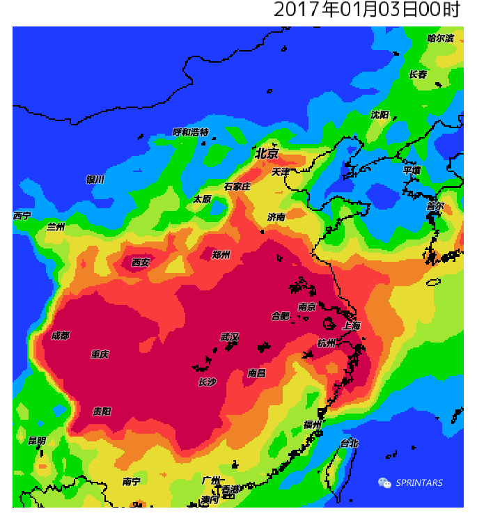
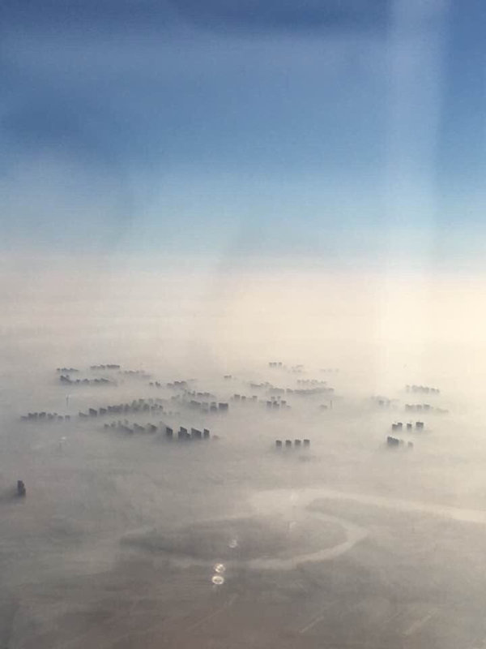
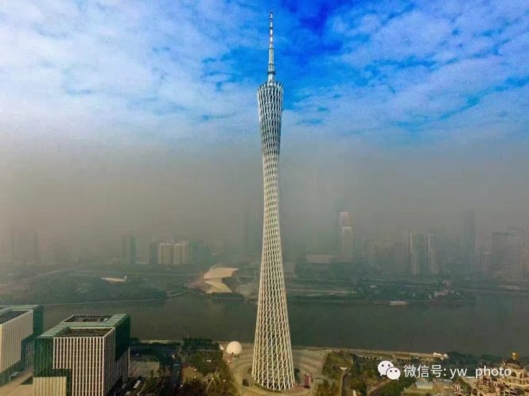
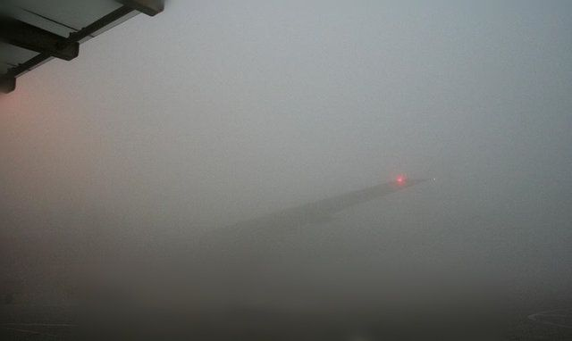
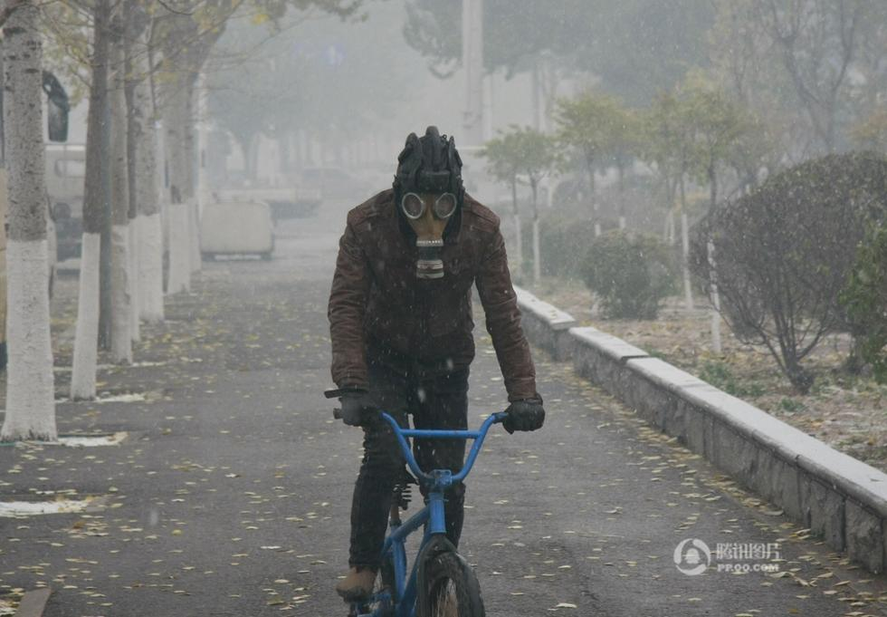
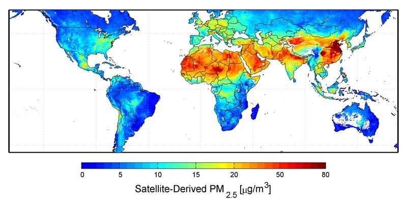
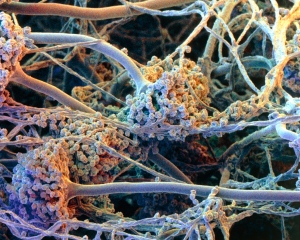
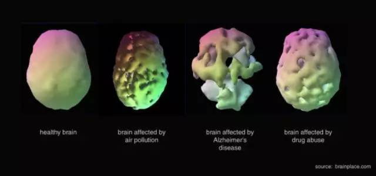
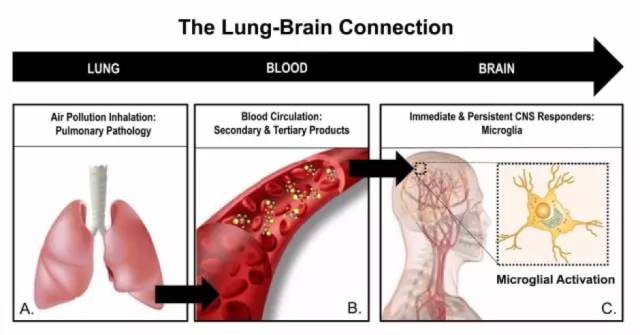

# 从几个不同的角度聊聊“雾霾的危害” 

-----

 ## ★引子：为啥到现在才开始聊雾霾？
----------------

  
 前2年就已经有读者建议俺聊聊雾霾这个话题；最近一个月，提出类似建议的读者又多了好些。  
 其实俺早几年就在关注自己生活中的雾霾是否严重，只不过一直没有发这方面的博文。为啥捏？  
 咱们天朝的大多数民众有一个毛病——当危险和灾难没有直接降临到自己头上时，大多数人不会引起足够的重视。别人的苦难要么被忽略，要么只是成为茶余饭后的谈资，仅此而已。（这就是“[民族劣根性](https://program-think.blogspot.com/2013/11/weekly-share-57.html)”的其中一种症状——鲁迅称之为“冷漠的看客”）  
 前些年，只有个别省份遭遇了【重度】雾霾。俺如果在前几年发雾霾的博文，估计只有少数读者会引发重视——他们重视是因为他们所在省份已经 PM2.5 爆表了。  
 但现在不同了。跨越2017年元旦的这场【全国性】雾霾，已经波及了每一个人口密集的省份。俺相信，本博客在墙内的大部分读者，都已经被波及了。这时候来聊聊雾霾，想必重视的读者会多一些吧。program-think  
   
   
 ## ★从地理的角度——所有人口密集的省份都被【重度雾霾】攻陷
----------------------------

  
 以下这张图演示了1月3日到1月9日，大半个中国被【重度雾霾】影响。  
   
   
 有心的读者不妨计算一下：被【红色及橙色】波及到的地区，其人口数占天朝总人口的百分之几？  
 补充更新：  
 本文发出后，某热心读者在评论中补充如下：  
 
> 地理上的“黑河-腾冲线”，1987年测算的数据是：线以东的地区人口占全国的比重为【94.4%】。这次雾霾席卷整个东部地区，甚至包括四川地区。在“黑河-腾冲线”东,不算人口占比 9% 的东北三省来说（图上他们最多只被黄色覆盖），大约有【85%】的人口受到此轮雾霾影响。 俺的补充：  
 上述动态图的时间仅仅是“1月3日到1月9日”，如果算上去年11月12月，那时候东三省也遭遇重度雾霾。（如果这位热心读者的数据准确）加上东三省，受灾人口比例就高达【94%】。  
   
   
 下面顺手贴几张各大城市的照片。  
   
   
 （1月6日）从空中看北京城，是不是很诡异？  
   
 （1月6日）从空中看广州城，清浊两重天  
   
 （1月4日）天津机场，能见度都快趋向于零  
   
 （去年12月）成都，连大熊猫也戴口罩了  
   
 （去年11月8日）沈阳 PM2.5 浓度爆表（超一千）；这个小伙子也是够拼的，为了自行车运动，防毒面具都戴上了  
 本来还可以继续列举全国各大城市的很多照片。不过俺想：只要你生活在天朝，不用看照片，你的呼吸系统已经能给你一个直接的反馈了。  
   
   
 ## ★从时间的角度——【至少】在2001至2006年，咱们的 PM2.5 就已经是全球最浓郁了
---------------------------------------------

  
 下面俺给出 NASA（美国宇航局）官网的文章，如下：  
 《[New Map Offers a Global View of Health-Sapping Air Pollution @ NASA](https://www.nasa.gov/topics/earth/features/health-sapping.html)》  
   
 看不懂洋文没关系，你只要能看懂 NASA 提供的这张世界地图就行。  
   
 （全球的 PM2.5 影响地图，基于 NASA 的卫星观测数据）  
 注：原始图比较大，尺寸是“2400x1200”。考虑到博文的载入速度，此处放置的是稍微缩小的图片。想下载原始图，请点击“[这个链接](https://www.nasa.gov/images/content/483897main_Global-PM2.5-map.JPG)”。  
   
 为了照顾那些“地理盲”的同学，俺稍微解读一下：  
 全球几个比较红（越红越严重）的地方，分别是：中国东部，非洲北部，印度北部及巴基斯坦，阿拉伯半岛，中国新疆。  
 其中的“非洲北部，阿拉伯半岛，中国新疆”是由于沙漠的缘故；而最严重的“中国东部”，显然与沙漠无关。  
   
 请注意：这篇文章注明的采样时间段是【2001~2006】。考虑到 PM 2.5 引发的雾霾不可能是一夜之间出现在天朝，而是一个缓慢累积的过程。恐怕上世纪90年代，PM 2.5 就已经开始变得严重了，只不过当时没有引发关注，咱们天朝当时也没人对此加以研究。  
 换句话说：至少有15年（甚至是20年）的时间，我等天朝屁民一直生活在全球最差的空气质量里面。这么长的时间，新生婴儿也已经成人了。  
 写到这里，俺想起网上一个调侃的笑话：  
 
> 投胎的时候选择了“Hard 模式”，结果降生到天朝；  
>  还好没有选“Very Hard 模式”，否则投胎到北朝鲜。  
 ## ★从生物学的角度——雾霾中的微生物很丰富哦
---------------------

  
 聊完了“空间和时间”两个角度，接下来说说雾霾里的“微生物学”。  
 引述一篇比较权威的报道，出自《Nature》，文章如下：  
 《[Beijing smog contains witches' brew of microbes @ Nature](http://www.nature.com/news/beijing-smog-contains-witches-brew-of-microbes-1.14640)》  
   
 这篇虽然刊登在老外的网站上，但引用的是【天朝的】研究人员作出的结论。下面这张是文中的配图。  
   
 （通过“扫描电子显微镜”看到的曲霉菌，这是中国研究人员在北京雾霾样品中发现的【多种】有害微生物之一）  
 考虑到大部分读者不看洋文，引述 Solidot 对此文的转载（链接在“[这里](http://www.solidot.org/story?sid=38227)”）。内容摘录如下，粗体是俺标注滴：  
 
> 中国研究人员利用基因测序技术从（北京的）雾霾颗粒中识别出了 1300 种不同的微生物物种，大多数微生物是良性的，但也有少数可能会诱发过敏和呼吸道疾病。在严重的污染天，来自这些过敏原和病原体的 DNA 还成比例的增加，暗示它们可能对易感群体带来额外的威胁。科学家于2013年1月在7个连续日收集了14个空气样本，过滤出 PM2.5（直径小于2.5微米）和 PM10 两类粒子，对微生物 DNA 进行测序，然后将结果与基因数据库进行匹配。研究发现，最常见的微生物物种是土壤细菌 Geodermatophilus obscurus。此外还发现了会导致肺炎的 Streptococcus pneumoniae，真菌性过敏原 Aspergillus fumigatus，**以及大量通常在排泄物中发现的细菌**。在**雾霾最严重的日子，这些 DNA 的比例增至2到4倍**。  
 ## ★从生理学的角度——雾霾对各个器官（包括大脑）的影响
--------------------------

  
 ### ◇对心肺的影响

  
 为了表示权威性，俺引用咱们天朝官方的《科技日报》网站上的文章（链接在“[这里](http://www.stdaily.com/kjrb/kjrbbm/2017-01/09/content_500991.shtml)”）。文章比较长，摘录部分内容如下，粗体是俺标注滴：  
 
> 虽然雾霾危害人体，呼吸系统“首当其冲”；“**但80个 PM2.5 微粒可以堵死一个肺泡的说法不科学。**”在接受科技日报记者采访时，中日医院呼吸与危重症医学科二部副主任医师万钧表示，雾霾颗粒对于人体的伤害**并不是机械性地“堵死”肺泡，而是粘附于肺泡及小气道表面，进而诱发炎症，最终影响气体交换或继发其他病变。** 
>  ......  
>  万钧解释说：“在短期内，我们体内的保护机制可以帮助我们清除掉这些吸入的颗粒，但是**长期反复大量地吸入，我们的纤毛系统就会遭到破坏，吞噬细胞的功能也会下降，从而导致对颗粒的清除能力下降，进而造成一些慢性损伤。**这些损伤包括气道的上皮细胞形成慢性炎症、支气管腺体增生、杯状细胞在气道分泌过多粘液等，最终导致呼吸障碍。”  
>  万钧指出：“PM2.5 浓度增加可以导致呼吸系统疾病死亡率上升这是不争的事实。但是，“80个 PM2.5 微粒堵死一个肺泡”的“精确”计量，目前国内国外都没有明确的医学文献支持。......现在已经肯定的是：浓度越高，对人体的危害越大，但由于这涉及长期的、大规模人群实验，具体的量值和对人体具体的伤害，还没有准确数据。”  
>  ......  
>  著名心血管领域专家胡大一教授说：“当人们长期暴露在雾霾环境下，相当于新增了一个心血管疾病危险因素，如同给心脏‘埋下地雷’。同时，在短期暴露下，它又可以使尚不严重的心血管斑块突然破裂，产生血栓，诱发急性心肌梗死，成为一道‘导火线’。”  
>  ......  
>  PM2.5还是引起高血压多发的一个独立的危险因素。北京大学医学部公共卫生学院教授潘小川发表论文称，“我们利用时间系统分析研究，对搜集的数据进行分析发现，**PM2.5 每立方米浓度增加10微克，医院高血压类的急诊病人就会增加 8%，心血管疾病也会增多。**”  
>  ......  
>  胡大一指出，除了直接作用于心血管系统，**由雾霾引发的焦虑抑郁情绪也值得关注**，这些负面情绪也可导致一系列连锁性心血管疾病。  
 ### ◇对大脑的影响

  
 先给大伙儿看一篇新浪财经的报道（链接在“[这里](http://cj.sina.com.cn/article/detail/1638782947/139591)”）。内容稍微有点长，俺摘录如下，粗体是俺标注滴：  
 
> **雾霾带给大脑的伤害，远比肺更强。** 
>  雾霾心血管以及呼吸系统的伤害，早在上个世纪 70 年代就被科学证实了。同时，那个年代的心理学家也提出雾霾天会影响人的情绪，增加抑郁症的患病几率。总而言之，以上这两点都是老生常谈。  
>  而 21 世纪，关于空气污染和心理学的交叉研究则取得了新的突破。那就是，心理学家们发现——空气污染也会对人类脑组织产生影响和损伤。相关理论主要集中在以下三方面：  
>  **1. 空气污染会引起大脑结构功能改变，造成记忆力下降以及抑郁症等。  
>  2. 空气污染对未成年人认知功能发育的影响，因此教育机构不应建在重污染区域；  
>  3. 空气污染加速成年人认知能力的衰退，是老年痴呆症的一大诱因。** 
>    
>    
>  （图一：健康的大脑；图二：受空气污染影响的大脑；图三：老年痴呆症的大脑；图四：受吸毒影响的大脑）  
>  ......  
>    
>  而最近的一项心理学研究发现，不同于 PM2.5~10 的粗颗粒污染物（如沙尘暴），**PM 小于 2.5 的雾霾可以通过呼吸道直达我们的大脑。** 
>    
>  （肺部直通大脑的示意图）  
>  美国芝加哥拉什医学院（Rush Medical Collage）心理学教授 Jennifer Weuve 做过一项针对极细小颗粒物的空气污染源和粗颗粒物的污染源的研究。结果表明，**只有 PM 小于 2.5 的极细颗粒污染源，才能侵入大脑**。并且，Jennifer 的研究团队还对养老院的 19000 名年长女性的记忆能力和居住的地址进行比对研究，她惊奇地发现，**那些常年生活在空气污染严重地区的被试者，晚年的记忆衰退更严重，更容易患上老年痴呆症。** 
>  Weuve 教授说“细小的空气颗粒物极易穿透人类的天然防御屏障，它们甚至可以通过肺部来到血液中，并且借由嗅觉神经的神经突触直达大脑。”  
>  ......  
>  最后，在遥远的西半球，也有一个跟北京一样的雾都——墨西哥首都墨西哥城。最近，加拿大蒙大拿大学的墨西哥裔心理学家 Calderón-Garcidueñas 做了一项针对祖国国民的雾霾研究，结果让人不寒而栗！  
>  在对墨西哥城以及其他城市（非雾霾城市）的近百名被试进行了脑补扫描之后，Calderón-Garcidueñas 证实了自己的最初猜想：在雾霾城市生活得被试更容易有脑膜炎，并且他们的前额皮质相较于正常空气环境下的被试，已经有了显著的组织损伤。  
 如果你觉得上述这篇还不够严肃，俺再给出两篇国外权威媒体的相关报道，分别来自 BBC 与 NHS。  
 《[Pollution particles 'get into brain' @ BBC](http://www.bbc.co.uk/news/science-environment-37276219)》  
 《[Pollution particles in the brain 'linked to Alzheimer's disease' @ NHS](http://www.nhs.uk/news/2016/09September/Pages/Pollution-particles-in-the-brain-linked-to-Alzheimers-disease.aspx)》  
 说到 BBC，大伙儿都比较熟悉，俺就不介绍了；至于这个“NHS”是洋文“[National Health Service](https://en.wikipedia.org/wiki/National_Health_Service)”的缩写，中文翻译成“国民保健署”——它是英国官方四大公立医疗机构的总称。  
   
 俺提醒各位注意一下：  
 上述关于“空气污染对大脑的影响”的研究，针对的样本还不够大。并且这类研究进行得还不够多。  
 今后在这方面进行深入研究，得出的结论与上述结论相比：可能更轻微，也可能更严重。如果是“更轻微”，当然皆大欢喜；万一是“更严重”，那就杯具了。  
 考虑到大脑这个器官的重要性，以及大脑损伤的不可逆性。所以，对这类风险，俺还是宁可信其有，并尽可能防范，以免将来杯具了。  
   
   
 ## ★从心理学的角度——雾霾对心理的负面影响很大哦（难怪脑残这么多）
--------------------------------

  
 刚才聊到了雾霾对大脑的物理损伤。接下来说说由此引发的心理损伤。请看搜狐的这篇报道（链接在“[这里](http://green.sohu.com/20110712/n313139957.shtml)”）。内容摘录如下，粗体是俺标注滴：  
 
> 美国研究发现，长期生活在受污染的空气中，实验鼠的大脑会受到负面影响，导致其行为迟钝，记忆力衰退并易得抑郁症。  
>  美国俄亥俄州立大学的研究人员分别将两组实验鼠放在受污染的空气和过滤过的空气中，每天6小时，一周连续5天，时间长达10个月，因为10个月时间是老鼠一半的寿命。受污染的空气主要由汽车及工厂的废气组成，相当于某些受污染城市的空气。  
>  10个月后，研究人员对实验鼠进行行为测验。...... 结果发现，**生活在受污染空气中的实验鼠行为迟钝，其记忆力也比其他实验鼠差**。  
>  在另一个实验中，研究人员还发现，**生活在受污染空气中的实验鼠要比其他实验鼠更显抑郁和烦躁**。  
>  研究报告的主要作者劳拉方肯指出，研究结果表明，长期受到空气污染，将对大脑造成明显的负面影响，由此导致一系列健康问题。这一发现将对全世界长期工作与生活在空气污染环境下的人们提供有益的警示。  
>  该研究报告刊登在美国新一期学术期刊《分子精神病学》上。  
 可能有些读者觉得：这只是针对老鼠的试验，还不足以说明雾霾对【人】的心理影响。  
 为了继续吓唬大伙儿，俺再次引用前面提到的那篇[新浪财经的文章](http://cj.sina.com.cn/article/detail/1638782947/139591)。摘录内容如下，粗体是俺标注滴：  
 
> **雾霾可能拉低一代人的智商** 
>  证据一：  
>  美国波士顿大学心理学家 Shakira Franco Suglia 对参与调查的 200 名平均年龄 10 岁的波士顿儿童进行随机调查，结果发现那些成长在严重空气污染区域的孩子，在认知能力测试，记忆力测试以及 IQ 测试上面的成绩均**显著低于**居住在未污染城市的孩子。  
>  证据二：  
>  美国哥伦比亚大学的心理学教授 Frederica Perera 对近百名纽约市的新生儿进行了跟踪研究。研究开始于被试们出生之前，结束于他们7岁左右，结果发现，那些成长在污染严重地区的儿童相较于其他被试**更容易有注意力分散，焦虑症以及抑郁等倾向**。  
>  证据三：  
>  美国密歇根大学的一项心理学研究也发现，那些**位于严重空气污染地区的学校学生出勤率最低，并且学生挂科和肄业的比例也最高**。因此，这项研究的发起人 Mohai 强烈建议密歇根政府修改城市规划，把学校建在一些空气质量良好的地段。  
 （以后想骂一个人笨，不要再说“你脑子进水了”，改用更科学的说法——“你脑子进霾了”）  
   
   
 ## ★从饮食的角度——所谓的“清肺食品”是忽悠你的谣言
-------------------------

  
 如果你长期生活在天朝，应该会记得：  
 每当出现某个严重的传染病（不论是 SARS 还是禽流感），板蓝根都会热销——很多人天真地以为板蓝根包治百病。  
 如今全国都出现了严重的雾霾，而且危害又如此吓人。很自然地，各种号称能“清肺”食品纷纷出笼了。这些玩意儿，靠谱吗？  
 同样是在前面提到的那篇[《科技日报》的文章](http://www.stdaily.com/kjrb/kjrbbm/2017-01/09/content_500991.shtml)中，进行了如下辟谣（摘录如下，粗体是俺标注滴）：  
 
> 问：清肺食品真的管用吗？  
>  答：**靠饮食清除污染物很难** 
>  面对全国大面积的雾霾侵袭，网络上各种防霾方法层出不穷，其中提到比较多的是吃猪血、鸭血、木耳等清肺食品能够清肺除尘，这是真的吗？  
>  北京大学第一医院临床营养科营养师井路路在接受科技日报记者采访时表示：PM2.5 的入侵依赖于我们的呼吸系统，细颗粒物通过鼻腔进入到肺的细支气管甚至肺泡，最终沉积于此，并参与多种疾病的发生发展。而食物是从口腔进入人体，其后的消化吸收依赖的是我们的消化系统。  
>  ......  
>  可见，归属于呼吸系统的“雾霾”和归属于消化系统的“食物”走的是截然不同的两条“路”，因此，无论猪血、鸭血以及黑木耳等几乎没什么机会和有害物质“碰面”，自然也就无法产生反应了。  
>  井路路强调，目前**并无科学证据表明**：猪血、鸭血、黑木耳在消化吸收进入血液后，还能抵达 PM2.5 的集散地，起到“清道夫”作用。  
>  **目前任何食物都没法清除或减轻 PM2.5 对解剖学意义上的肺的不良影响，【不要轻信食物清肺的说法】。** 
 ## ★结尾
---

  
 写完这段“对清肺食品的辟谣”，俺不由得感叹：“天朝的脑残实在太多了，骗子都不够用了，奸商想不赚钱都难”。  
 所以俺一直在强调：心理素质（思维能力）很重要——政治上可以防朝廷的洗脑，生活中可以防各种忽悠。  
 关于思维能力，俺已经写了不少博文，希望大伙儿时常回顾一下，温故而知新。  
   
 （本文是关于“雾霾”的第一篇博文，后续俺还会针对这个话题，再写2到3篇。敬请关注）  
   
   
 **俺博客上，和本文相关的帖子（需翻墙）**：  
 [谈谈环保问题的根源和解决之道](https://program-think.blogspot.com/2012/08/environment-pollution-in-china.html)  
 [“片面强调 PX 低毒”属于偷换概念——广东茂名 PX 抗议活动随想](https://program-think.blogspot.com/2014/04/px-toxicity.html)  
 [每周转载：连云港民众抗议核废料处理厂（相关报道及网友评论）](https://program-think.blogspot.com/2016/08/weekly-share-104.html)  
 [每周转载：广东茂名反 PX 环保抗议活动（照片及网友评论）](https://program-think.blogspot.com/2014/04/weekly-share-64.html)  
 [每周转载：关于毒大米和土壤污染](https://program-think.blogspot.com/2013/05/weekly-share-52.html)  
 [每周转载：关于启东的环保抗议（照片多张、视频若干）](https://program-think.blogspot.com/2012/08/weekly-share-15.html)  
 [会叫的孩子有奶吃——启东人民在行动，上海人民怎么办？](https://program-think.blogspot.com/2012/07/qidong-and-shanghai.html) 